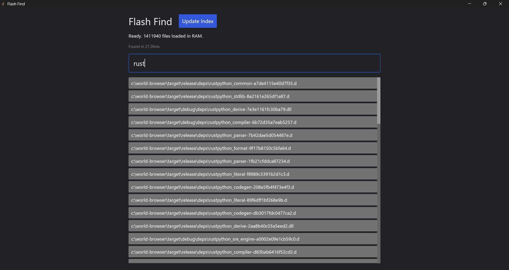



# Flash Find ⚡
### 20ms Instant Search for Windows

**[Download Latest Version](https://github.com/kcvabeysinghe/flash_find/releases)**

---

## 🚀 Why Flash Find?
Windows Search is slow. Flash Find is instant.
I built this tool to search **1.4 million files** in less than **25 milliseconds**.

* **⚡ Instant:** 20x Faster than Windows Search.
* **🔒 Private:** No background telemetry. No indexing when you aren't looking.
* **🎮 Gamer Friendly:** Uses 0% CPU when closed.
* **🦾 Powerful:** Built with Rust, Rayon Parallelism, and Memory Mapping.

## 📦 How to Install
1.  Go to the [Releases Page](https://github.com/kcvabeysinghe/flash_find/releases).
2.  Download `flash_find.exe`.
3.  Run it. (No installation required!)
4.  **Important:** Click the **"Update Index"** button once to scan your PC. (This takes about 1 minute).

## 🛠️ Technology
* **Language:** Rust 🦀
* **GUI:** Iced (Hardware Accelerated)

* **Engine:** Custom Parallel RAM Scanner

